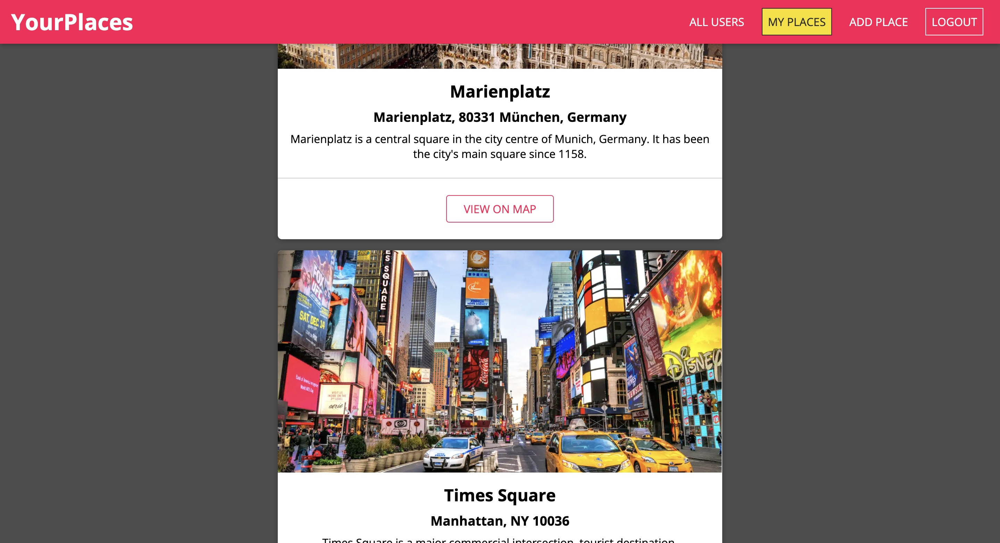
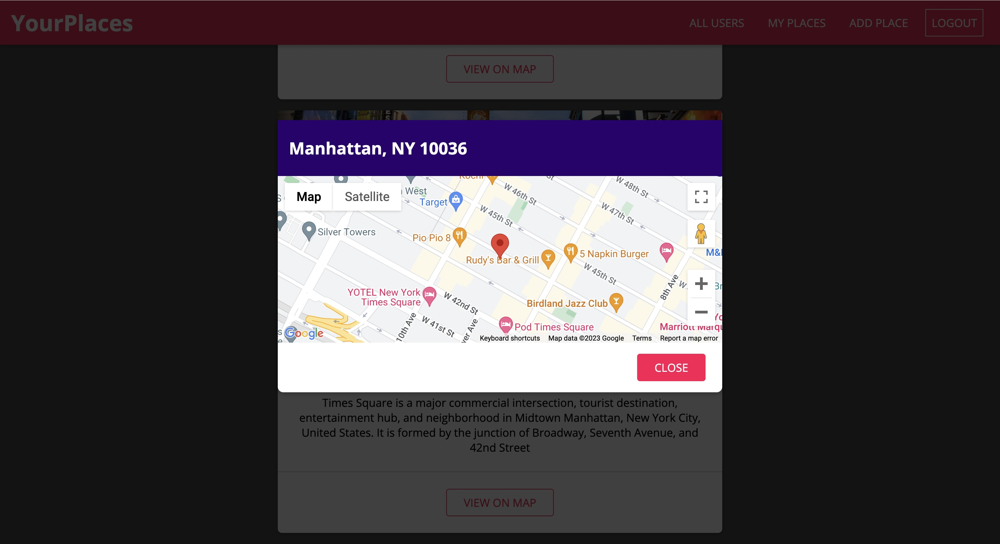
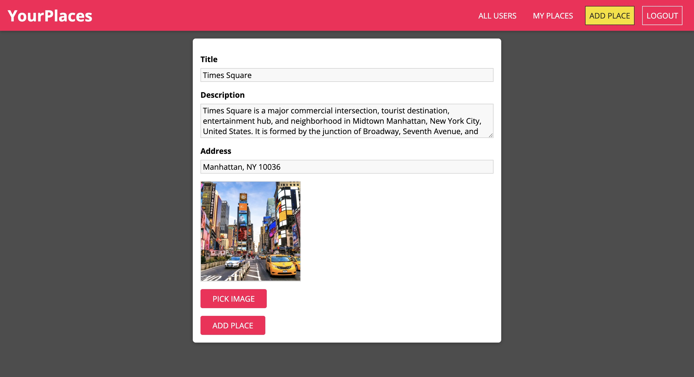
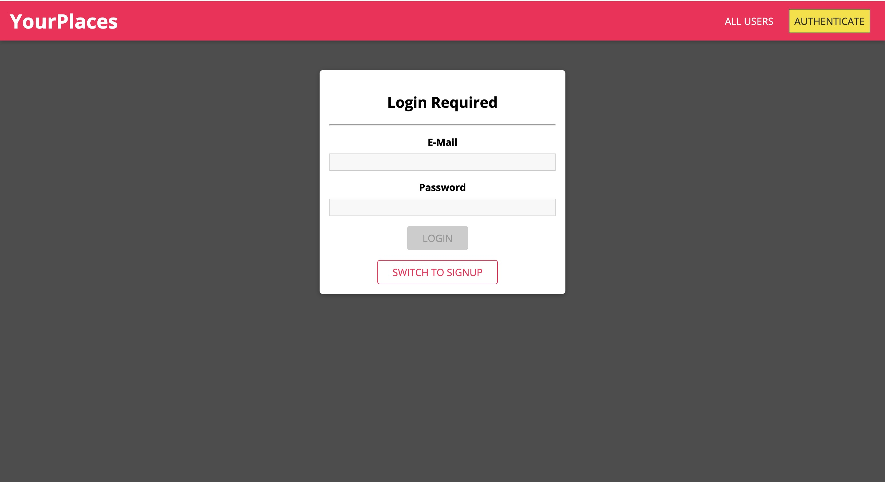

# MERN-FullStack-App - Travel Logs App

A Full Stack application for creating mini logs for all the places travelled along with their images and location details.
All users can create their own logs and also view the logs of other viewers.

#User Interface - 

### Running the Application -
**From the command line Interface Run -**
* For running the backend server - open Backend folder and run "npm start"
* For running the frontend server - open src folder and run "npm start"

